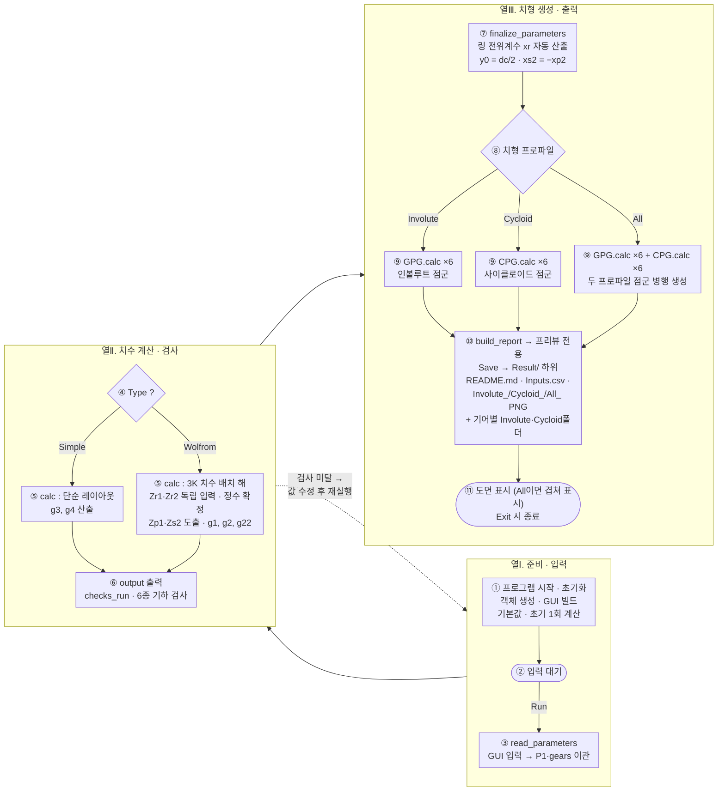
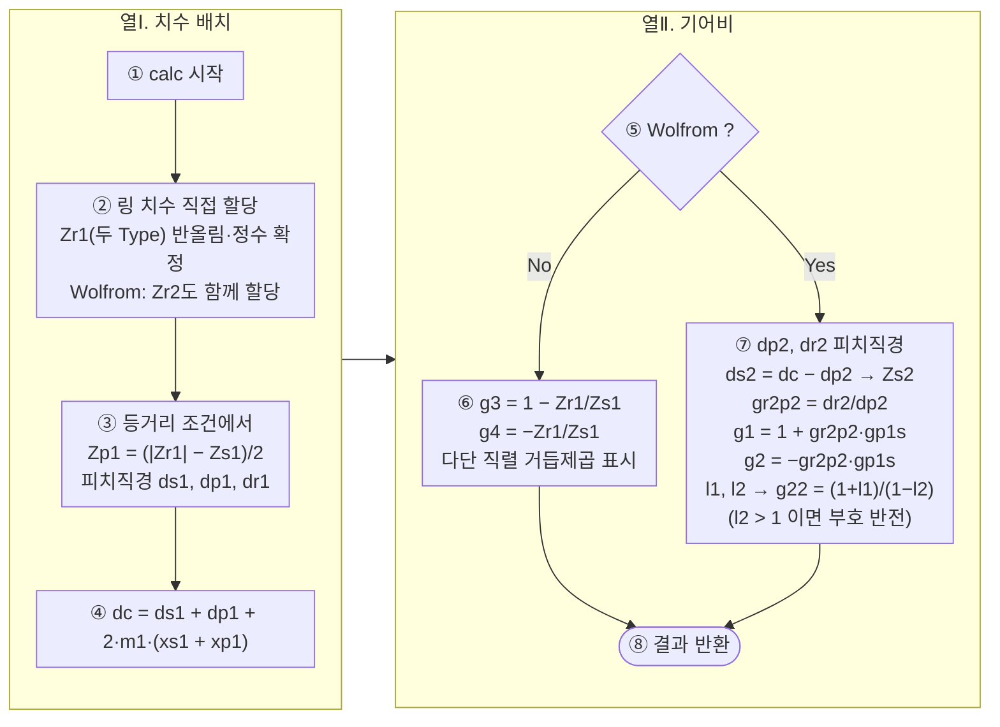
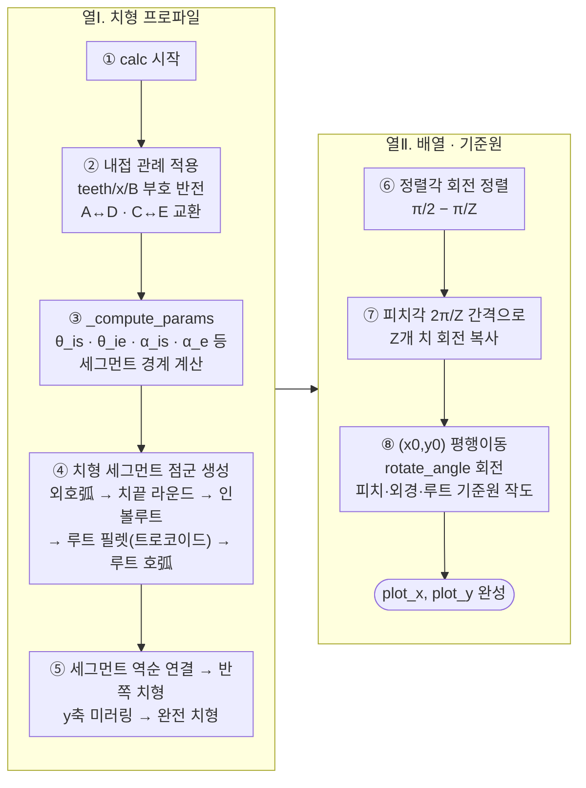

# PGS 사용 설명서 — 3K Wolfrom Gearbox 구성 및 설계

_PGS (Planetary Gear Set Sizing Tool) — Simple & Wolfrom 유성기어장치 치수 결정 도구_

이 문서는 `PGS.py`, `GPG.py`, `CPG.py`, `design.py` 소스 코드에 기반하여,
본 프로그램으로 **3K형 Wolfrom 유성기어장치(Wolfrom Gearbox)** 를 구성하고 설계하는 절차,
핵심 알고리즘과 이론, 그리고 프로그램의 플로우차트를 설명한다.

---

## 목차

1. [프로그램 개요와 기어 계통 구조](#1-프로그램-개요와-기어-계통-구조)
2. [3K Wolfrom Gearbox 구성 및 설계 순서](#2-3k-wolfrom-gearbox-구성-및-설계-순서)
3. [핵심 알고리즘과 이론](#3-핵심-알고리즘과-이론)
4. [플로우차트](#4-플로우차트)
5. [조합 사전 탐색 도구 (PRE-OPT_3K-WOLFROM)](#5-조합-사전-탐색-도구-pre-opt_3k-wolfrom)

---

## 1. 프로그램 개요와 기어 계통 구조

### 1.1 파일 구성

| 파일 | 역할 |
|------|------|
| `design.py` | GUI 진입점 (Tkinter/ttk 입력 화면, Run·Save 이벤트 처리, matplotlib 도면·프리뷰 출력, 보고서·PNG·기어별 CSV 및 FGPG2 결과 저장) |
| `PGS.py` | 유성기어장치 치수 계산기 (치수 배치 해, 기어비, 기하학적 제약 검사) |
| `GPG.py` | 인볼루트 치형 프로파일 생성기 (외/내접 기어 공용) |
| `CPG.py` | 사이클로이드 치형 프로파일 생성기 (`GPG`와 동일 인터페이스의 교체용 모듈) |
| `FGPG2_CLI.py` | 이식된 FGPG2 CLI 진입점 (`FGPG2_CLI.py <Inputs.csv> [involute\|cycloid]`) — 기어별 Result 파일을 재생성 |
| `PGS_CLI.py` | 명령줄(헤드리스) 실행기 — `.md` 리포트의 `## Input Parameters`를 읽어 GUI와 동일한 계산을 수행하고, SaveAll/SaveOK/SaveMD 옵션에 따라 결과 파일을 저장 (§2.9) |
| `fgpg2/` | 프로젝트에 이식된 FGPG2 치형 생성 패키지 (`gear.py`, `cycloid.py`, `exporters.py`, `plotter.py`) — Save 시 `Result.csv`/`Result.dxf`/`Result1.png`/`Result2.png`를 인프로세스로 생성 |
| `PGS.bat` / `PGS.sh` | OS별 실행 스크립트 |
| `PRE-OPT_3K-WOLFROM.py` | 조합 사전 탐색 GUI — 3K-Wolfrom 파라미터 공간을 스캔하여 기하적으로 성립 가능한 조합을 표로 나열, `Result.xlsx` 저장 및 선택 조합을 `design.py`로 연동 (§5) |
| `PRE-OPT_3K-WOLFROM.bat` / `PRE-OPT_3K-WOLFROM.sh` | PRE-OPT 전용 실행 스크립트 |

### 1.2 Wolfrom(3K) 유성기어장치의 구조

프로그램이 다루는 3K형 Wolfrom 기어장치는 **캐리어(Carrier) 하나를 공유하는 2단 유성기어 세트**이다. 총 6개의 기어로 구성된다.

```
             ┌─────────────── 1단 (Module m1) ───────────────┐
   입력 ⊙── Gs1 (태양기어, Zs1) ── Gp1 (유성기어, Zp1) ── Gr1 (링기어, Zr1, 고정)
                         │
                    캐리어 (반경 dc/2 위에 Gp1과 Gp2가 강체 결합)
                         │
             ┌─────────────── 2단 (Module m2) ───────────────┐
              Gs2 (태양기어, Zs2) ── Gp2 (유성기어, Zp2) ── Gr2 (링기어, Zr2, 출력)
```

- **1단**: 태양기어 `Gs1` ↔ 유성기어 `Gp1` (외접), `Gp1` ↔ 링기어 `Gr1` (내접), 모듈 `m1`
- **2단**: 태양기어 `Gs2` ↔ 유성기어 `Gp2` (외접), `Gp2` ↔ 링기어 `Gr2` (내접), 모듈 `m2`
- **유성기어 결합**: `Gp1`과 `Gp2`는 서로 다른 직경을 가지면서 같은 축 위에서 일체화되어 캐리어 반경 `dc/2`에 놓인다.
- **3K 동작**: 태양기어 `Gs1`(입력) — 링기어 `Gr1`(고정) — 링기어 `Gr2`(출력). 캐리어는 토크를 전달하지 않고 유성기어의 자리만 지지한다("Type-3K : Carrier Free").

### 1.3 기어 종류(Type 코드)

| Type 코드 | 의미 |
|-----------|------|
| 0 | Simple (단순 단단) |
| 1 | 3K-Wolfrom (두 링기어의 치수 차로 감속비를 조절) |

두 링기어의 치수 차 $|\,|Z_{r1}| - |Z_{r2}|\,|$ 는 두 독립 입력($Z_{r1}$, $Z_{r2}$)으로 정해지는 값이며, 감속비의 크기를 좌우한다 (§3.2, §3.4-c 참조).

---

## 2. 3K Wolfrom Gearbox 구성 및 설계 순서

### 2.1 Step 0 — 실행

```bash
uv sync            # 최초 1회: 의존성 설치
uv run design.py   # GUI 실행 (또는 Windows: PGS.bat / Linux: ./PGS.sh)
uv run design.py Result/README.md   # 보고서 경로 인자 → 시작 시 파라미터 자동 입력 후 바로 계산
uv run PRE-OPT_3K-WOLFROM.py  # 조합 사전 탐색 (§5; Windows: PRE-OPT_3K-WOLFROM.bat / Linux: ./PRE-OPT_3K-WOLFROM.sh)
```

### 2.2 Step 1 — 감속비 요구치를 Type 및 링 치수(Zr1·Zr2) 선택으로 변환

3K 감속비는 근사적으로 $i_{3K} \approx \dfrac{Z_{r1}/Z_{s1}}{1 - \dfrac{Z_{r1} Z_{p2}}{Z_{r2} Z_{p1}}}$ 형태이며, 두 링기어의 치수 차 $|\,|Z_{r1}| - |Z_{r2}|\,|$ 가 작을수록 감속비가 커진다.

- **Type 콤보박스**에서 `Simple` 또는 `3K-Wolfrom` 중 선택한다.
- 두 링기어 치수 `Ring1 Teeth, Zr1` 와 `Ring2 Teeth, Zr2` 는 **독립 입력 변수**로, 각각 1단·2단 링기어 치수를 직접 기입한다 (§3.2 참조).
- `3K-Wolfrom`을 선택하면 `Planet2 Teeth, Zp2` 바로 아래에 `Ring2 Teeth, Zr2` 입력란이 표시된다.
- `Simple`을 선택하면 2단 관련 입력(`Module2, m2` · `Shift factor, Gp2.X` · `Ring2 Teeth, Zr2` · `Planet2 Teeth, Zp2`)이 숨겨진다. Plot 옵션도 1단 전용(`Stage1`/`Gs1`/`Gp1`/`Gr1`)만 제공한다.
- 감속비를 높이려면 두 링기어의 치수 차가 작아지도록, 감속비를 낮추려면 치수 차가 커지도록 $Z_{r2}$ 를 조정한다 ($Z_{r1}$ 와 조합).
- GUI 기본값은 `3K-Wolfrom` / `Zr1 = 90.0` · `Zr2 = 54.0` 이다 (이때 $m_1=0.8$, $m_2=1.2$, $N_p=3$, $Z_{p2}=20$, $Z_{s1}=12$ 이면 감속비 58.5).

### 2.3 Step 2 — 독립 설계 변수 입력 ("Planetary System" 카드)

3K Wolfrom 시스템의 독립 설계 변수는 정확히 7개($m_1$, $m_2$, $N_p$, $Z_{r1}$, $Z_{r2}$, $Z_{p2}$, $Z_{s1}$)이다. 나머지 치수(`Zp1`, `Zs2`)와 직경들은 자동으로 결정된다. **Simple**은 1단만 존재하므로 `Zr2`·`Zp2`를 입력하지 않고, `m2`·`Gp2.X`는 비활성화된다.

| 입력 항목 | 기호 | 의미 / 선정 지침 |
|-----------|------|------------------|
| Planet number, Np | $N_p$ | 유성기어 개수 [ea], > 2 (등간 배치·조립 조건을 만족해야 함) |
| Module1, m1 | $m_1$ | 1단 모듈 [mm], > 0 |
| Module2, m2 | $m_2$ | 2단 모듈 [mm]. 통상 $m_2 > m_1$ |
| Sun1 Teeth, Zs1 | $Z_{s1}$ | 1단 태양기어 치수 [ea] — **기어비를 직접 좌우하는 값** |
| Ring1 Teeth, Zr1 | $Z_{r1}$ | 1단 링기어 치수 [ea] — **직접 입력** (Simple·Wolfrom 공통) |
| Planet2 Teeth, Zp2 | $Z_{p2}$ | 2단 유성기어 치수 [ea] — **3K-Wolfrom만 직접 입력** |
| Ring2 Teeth, Zr2 | $Z_{r2}$ | 2단 링기어 치수 [ea] — **3K-Wolfrom만 직접 입력** |
| Input speed, ns1 | $n_{s1}$ | 태양기어 `Gs1`의 입력 회전수 [rpm] — **Speed 블록(§3.4-e·f)의 운전 속도 계산에 사용** |

> UI 배치 순서는 **Type → Planet number Np → Module1 m1 → Module2 m2 → Sun1 Zs1 → Ring1 Zr1 → Planet2 Zp2 → Ring2 Zr2 → Input speed ns1** 이다.

### 2.4 Step 3 — 치형 상세 파라미터 입력 ("Involute Gear Spec" 카드)

| 입력 항목 | 기호 | 의미 |
|-----------|------|------|
| Shift factor, Gs1.X | $x_{s1}$ | 1단 태양기어 전위계수. `Gp1.X`와 함께 캐리어 반경을 결정 |
| Shift factor, Gp1.X | $x_{p1}$ | 1단 유성기어 전위계수 |
| Shift factor, Gp2.X | $x_{p2}$ | 2단 유성기어 전위계수 (자동으로 $x_{s2}=-x_{p2}$ 가 되어 2단 외접 물림이 성립) |
| Backlash factor, B | $B$ | 백래시 계수 (치두께를 얇게 하는 양, ×m 로 적용) |
| Addendum factor, A | $A$ | 임의 높이 계수 |
| Dedendum factor, D | $D$ | 임의 깊이 계수 |
| Pressure angle, α | $\alpha_0$ | 압력각 [deg] (표준값 20°일 때만 간섭 검사가 유효) |
| Hob end radius, C | $C$ | 호브 선단 코너 반경 [mm] (루트 필렛 형상) |
| Tooth end radius, E | $E$ | 치 끝단 라운딩 반경 [mm] |

**참고 — 링기어 전위계수($x_{r1}, x_{r2}$)는 입력하지 않는다.**
두 링기어의 전위계수는 프로그램이 캐리어 반경에서 "플랭크 여유 없는 무백래시 내접 물림"이 되도록 자동 산출한다(§3.5 참조). 입력한 $B$ 는 그 위에 덧붙는 플랭크 여유로 작동한다.

### 2.5 Step 4 — Plot 옵션과 치형 종류 선택

**Plot option** — 프리뷰 인터랙티브 창과 **저장 시 도면 범위**를 결정한다:

- 개별 기어: `Gs1` / `Gp1` / `Gr1` (1단), `Gp2` / `Gr2` (2단, Wolfrom 한정) — 선택한 기어 하나만 도면
- 구성 단위: `Stage1`(1단만) / `Stage2`(2단만, **Wolfrom 한정**) / `Total`(1·2단 전체 겹침 도면)
- Simple에서는 1단 전용 옵션(`Stage1` / `Gs1` / `Gp1` / `Gr1`)만 제공된다.
- 유성기어(`Gp1`, `Gp2`) 선택 시 `Np`개의 유성기어 배열이 그려진다.

색상 규칙: 1단 기어는 **회색 계열**(인볼루트 = `dimgray`, 사이클로이드 = `#95c4ed`), 2단 기어는 **검정/남색 계열**(인볼루트 = `black`, 사이클로이드 = `#19609d`)로 구분된다.

**Teeth profile** — 치형 프로파일 종류를 선택한다:

- `Involute Teeth`(GPG) 또는 `Cycloid Teeth`(CPG) 중 하나만 선택
- **`All`** — **인볼루트와 사이클로이드 두 프로파일을 동시에 겹쳐서** 도면. 각 프로파일은 고유 색상으로 구분되어 어느 Plot 선택 옵션에서도 함께 표시된다.

> **참고 — 저장 시 산출 파일명**: `Plot option`과 무관하게 **전체 대상에 대해 도면을 모두 저장**한다. 파일명 규칙은 §2.6 Save 단계의 [결과 파일] 목록 참조.

### 2.6 Step 5 — Run · Load · Save 버튼 (계산 · 재사용 · 파일 저장)

**Run**을 누르면 계산·프리뷰만 수행되고 **파일은 저장되지 않는다**:

1. `read_parameters()` — GUI 입력값을 모델 객체로 이관
2. `PGS.calc()` — 치수 배치 해·직경·기어비 계산 (§3.2~3.3)
3. `PGS.output()` — 비율·치수 결과 stdout 출력
4. `PGS.checks_run()` — 6종 기하학적 타당성 검사 (§3.6)
5. `finalize_parameters()` — 링기어 전위계수 자동 산출 등 최종 파라미터 확정 (§3.5)
6. 각 기어별 `GPG.calc()` — 6개 기어(또는 Simple은 3개)의 치형 점군 생성 (§3.7)
7. `build_report()` — Markdown 보고서를 Result 패널에 표시
8. `plot_pgs()` — 선택한 Plot option에 따라 인터랙티브 프리뷰만 표시 (Teeth profile이 `All`이면 두 치형 프로파일을 겹쳐 표시)

**Load**를 누르면 **파일 선택 대화상자**가 열리고, 원하는 경로의 **`README.md`** 파일(`Result/README.md` 등)을 고르면 그 파일의 `## Input Parameters` 섹션을 읽어 **UI의 파라미터 입력창을 자동으로 다시 채운다**. 이어서 Run과 동일하게 `read_parameters → run_calc → build_report → plot_pgs`를 수행하므로, 이전에 Save로 저장한 설계를 즉시 불러와 같은 값을 확인·이어서 수정할 수 있다.

> - 입력 파라미터 섹션이 없는 파일을 고르면 경고창이 뜨고 아무것도 바뀌지 않는다. `## Input Parameters` 섹션의 형식은 아래 [Save 결과 파일]의 `Result/README.md` 항목과 동일하다.
> - 보고서에는 링기어 치수가 음수로 기록되므로(`-90.0`), 불러올 때는 입력창이 기대하는 양수 값(`90.0`)으로 자동 변환된다.

**Save**를 누르면 폴더 선택 대화상자가 열리고, 선택한 폴더 아래에 `Result/`를 만들고 **동일 계산을 재실행**하여 모든 산출물을 저장한다 (저장 중에는 Save 버튼이 비활성화되고 완료 후 다시 활성화된다).

- `Result/README.md` — 보고서 (Result 패널과 동일 내용)
- `Result/Involute_*.png`, `Result/Cycloid_*.png`, `Result/All_*.png` — **전체 대상에 대한 치형 도면**
  - 명명 규칙: `{Involute|Cycloid}_` 접두사 + 범위(`Stage1`/`Stage2`/`Total` 또는 기어명 `Gs1`/`Gp1`/`Gr1`/`Gp2`/`Gr2`)
  - `All_*`는 **각 보기**(전체·기어별)별 겹침 도면으로, 3K-Wolfrom은 `All_Total`, `All_Gs1`, `All_Gp1`, `All_Gr1`, `All_Gp2`, `All_Gr2` 6종, Simple은 `All_Stage1`, `All_Gs1`, `All_Gp1`, `All_Gr1` 4종
  - 합계: 3K-Wolfrom은 `Involute_`/`Cycloid_` 각 8개 + `All_` 6개 = **22개**, Simple은 각 4개 + 4개 = **12개**
  - 사이클로이드 기하 생성이 불가능하면(예: 비정수 $Z_{s2}$) 콘솔에 `WARN`을 출력하고 **Cycloid/All 도면만 건너뛴다** (인볼루트 도면·보고서·기어별 결과는 정상 저장).
- `Result/<Gear>/Inputs.csv` — 기어별 가공입력 (Gs1, Gp1, Gr1, [+Gp2, Gr2]; Gs2 제외)
- `Result/<Gear>/{Involute,Cycloid}/` — 프로파일별 FGPG2 결과
  - `Inputs.csv` + `Result.csv`(치형 좌표) + `Result.dxf`(절삭 도면) + `Result1.png`(치형 개수 view) + `Result2.png`(닫힌 치형 view) — `FGPG2_CLI.py <csv> [involute|cycloid]`를 인프로세스로 호출해 생성

### 2.7 Step 6 — 결과 확인 및 반복 수렴

Result 패널(및 저장된 `Result/README.md`)에서 아래를 확인한다:

- **Check Geometrical Conditions** — 6종(1단) 검사 전부가 통과("OK")될 때까지 Step 2~4의 값을 바꾸며 반복한다.
  - 실패 시의 조정 방향 예시: `Equal Distance` 실패 → $Z_{s1}$·$Z_{r1}$·$N_p$ 조합 변경 / `Planets Interference` 실패 → $N_p$ 축소 또는 유성 치수 $Z_{p1}=(|Z_{r1}|-Z_{s1})/2$ 축소 / `Trimming Interference` 실패 → $|Z_{r1}|-Z_{p1} \ge 16$ 가 되도록 링·유성 치수 차 확대. 검사는 **1단 기어만** 보므로, 감속비는 2단 입력($Z_{r2}$, $Z_{p2}$, $m_2$)으로 조정하고 1단 검사는 $Z_{s1}$·$Z_{r1}$·$N_p$ 로 통과시킨다.
- **Ratio** — 각 단 및 전체 기어비 (§3.4의 정의대로 출력됨)
- **Speed** — 조립 구성별 운전 속도 (Wolfrom 3종 §3.4-e, Simple 2종 §3.4-f)
- **Size** — 기어들의 피치원 직경과 치수, 캐리어 반경 (Simple은 1단 3개만)
- **기어별 스펙(### Gs1, Gp1, Gr1, Gp2, Gr2)** — 도면화용 치형 상세 파라미터. 가상 2단 태양기어 `Gs2` 스펙은 보고서에 출력되지 않는다.

**주의**: 2단 태양기어 치수 $Z_{s2}$ 는 캐리어 반경에 맞춰 계산되므로 정수가 아닐 수 있다(예: 15.066667). 이는 실물 제작 시 특수 처리(장여향 전위·비정수 치수 절법 등)가 필요함을 의미하며, 도면화 관점의 기하 참조값이다.

### 2.8 설계 순서 요약 (한 장 요약)

```
감속비 요구치 결정 → Type 선택 → (Np, m1, m2, Zs1·Zr1, 그리고 Wolfrom은 Zp2·Zr2) 입력
→ 전위·백래시·치형 파라미터 입력 → Run (계산·프리뷰만)
→ 자동: 치수 배치 해(Zp1, Zs2), 기어비, 링 전위계수, 치형 도면
→ 기하 검사 6종(1단) 통과 여부 확인 → 미달이면 입력 변경 후 재실행(반복)
→ 전부 OK면 Save → 선택 폴더에 Result/ 생성 (README.md · 도면 PNG · 기어별 CSV·FGPG2 산출물)
→ 이후 이어서 설계할 때는 Load로 이전 Result/README.md 선택 → 파라미터 자동 재입력
→ 헤드리스 재계산·재저장은 CLI PGS_CLI.py <README.md> [SaveAll|SaveOK|SaveMD] 로 (§2.9)
```

### 2.9 명령줄(CLI) 실행 — `PGS_CLI.py`

GUI를 띄우지 않고도 **GUI Save와 동일한 계산·저장**을 수행할 수 있다:

```bash
uv run PGS_CLI.py <README.md> [SaveAll|SaveOK|SaveMD]
```

- `<README.md>` — `## Input Parameters` 섹션을 가진 마크다운 파일 경로(예: `Result/README.md`). 이 섹션에서 Type·치수·전위·백래시 등을 읽어 GUI `Run`과 동일한 계산을 수행한다.
- `SaveAll`(기본값) 또는 **argument 생략** — 계산 결과(`README.md` 보고서 · `Involute_*/Cycloid_*/All_*.png` 도면)와 개별 기어 폴더(`Gs1`/`Gp1`/`Gr1`[·`Gp2`/`Gr2`] + `Involute`·`Cycloid` 산출물)를 `<README.md>`와 **같은 폴더**에 저장한다. 저장 구조는 GUI Save와 동일하다.
- `SaveOK` — 새로 계산된 `## Check Geometrical Conditions`에 **"Fail" 상태가 하나라도 있으면 계산 결과·생성 파일을 저장하지 않는다**.
- `SaveMD` — `SaveOK`처럼 검사에 **"Fail"이 하나라도 있으면 아무것도 저장하지 않는다**. 검사가 **전부 "OK"인 경우에만 `README.md` 보고서 하나만** 저장하고, PNG 도면·기어별 폴더 등 나머지 파일은 저장하지 않는다.
- 저장되는 `README.md` 이름이 입력 파일과 같으면(`input.md` 외, 파일명이 `README.md`인 경우) **입력 보고서를 재생성 결과로 덮어쓴다**는 점에 유의한다.

---

## 3. 핵심 알고리즘과 이론

### 3.1 기호 정리

| 기호 | 의미 | 기호 | 의미 |
|------|------|------|------|
| $Z_{s1}, Z_{p1}, Z_{r1}$ | 1단 태양·유성·링 치수 ($Z_{r1}<0$: 내치) | $m_1, m_2$ | 1·2단 모듈 |
| $Z_{s2}, Z_{p2}, Z_{r2}$ | 2단 태양·유성·링 치수 ($Z_{r2}<0$: 내치) | $N_p$ | 유성기어 개수 |
| $d_{s}, d_{p}, d_{r}$ | 각 기어 피치원 직경 ($=mZ$) | $d_c$ | 캐리어(피치) 직경 |
| $x$ | 전위계수 | $\alpha_0$ | 압력각, $a_0=\alpha_0\,[\text{rad}]$ |
| $A, D, B, C, E$ | 임의 높이·깊이·백래시·호브선단·치선단 계수 | | |

### 3.2 치수 배치 해 (Teeth Layout Solver) — `PGS.calc()`

두 링 치수 $Z_{r1}$, $Z_{r2}$ 는 **독립 입력 변수**이며, 프로그램은 이로부터 나머지 치수를 결정한다. 정수 치수를 보장하기 위해 입력 링 치수도 반올림하여 사용한다.

**(1) 등거리 조건 (1단)** — 유성기어 중심이 캐리어 위에 있으려면:

```math
\begin{gathered}
|Z_{r1}| = Z_{s1} + 2Z_{p1}\\[6pt]
\Longrightarrow\quad Z_{p1} = \frac{|Z_{r1}| - Z_{s1}}{2}
\end{gathered}
```

즉 1단 유성 치수 $Z_{p1}$ 은 $Z_{s1}$, $Z_{r1}$ 에서 자동 결정된다.

**(2) 캐리어 직경** — 캐리어 직경은 1단 외접 물림의 운용 중심거리로 결정된다 (§3.3 참조). 2단 링기어는 이 캐리어 위에서 유성2와 맞물리며, 입력한 $Z_{r2}$ 와 표준 피치원이 정확히 맞지 않는 잔여 물림 오차는 **§3.5의 자동 링 전위($x_{r2}$)로 흡수**된다.

**(3) 2단 태양기어** — 2단 태양기어는 캐리어 반경 위의 자리에서 결정된다: $d_{s2} = d_c - d_{p2}$, $Z_{s2} = d_{s2}/m_2$.

> 프로그램 상에서 내치 기어는 부호 음수로 관리되므로 `self.zr1 = -floor(abs(zr1_input) + 0.5)` 형태이다. 두 링 치수를 독립 입력으로 두면 등간 배치·조립 조건에 맞지 않는 조합일 수 있으므로, 통과 여부는 §3.6의 검사에서 드러난다.

### 3.3 기어 직경과 캐리어

표준 피치원 직경:

```math
\begin{aligned}
d_{s1} &= m_1 Z_{s1},\\
d_{p1} &= m_1 Z_{p1},\\
d_{r1} &= m_1 |Z_{r1}|
\end{aligned}
```

**캐리어 직경**은 전위된 태양–유성 외접 물림의 운용 중심거리(선형 모델)로 계산:

```math
\boxed{
\begin{aligned}
d_c &= d_{s1} + d_{p1} + 2 m_1 (x_{s1} + x_{p1})\\
   &= m_1 (Z_{s1} + Z_{p1}) + 2 m_1 (x_{s1} + x_{p1})
\end{aligned}
}
```

즉, 전위 합 $(x_{s1}+x_{p1})$ 만큼 캐리어 반경이 선형적으로 밀려난다. 이는 생성기(GPG/CPG)가 그리는 오프셋 원 반경 $m\,(Z/2 + x)$ 와 일치하는 모델이다.

2단에서는 유성2가 캐리어에 고정되므로 거꾸로 태양2를 결정:

```math
\begin{aligned}
d_{p2} &= m_2 Z_{p2}, & d_{s2} &= d_c - d_{p2},\\[2pt]
Z_{s2} &= \frac{d_{s2}}{m_2}, & d_{r2} &= m_2 |Z_{r2}|
\end{aligned}
```

### 3.4 기어비 (Ratio) — Willis 속도 해석

유성기어장치의 속도 관계는 캐리어 기준 상대 회전(Willis 식)으로 쓴다. 외접쌍은 반대방향, 내접쌍은 같은 방향으로 상대 회전한다. 프로그램이 사용하는 3개의 기본 스칼라:

```math
\begin{aligned}
g_{p1s} &= \frac{d_{p1}}{d_{s1}} = \frac{Z_{p1}}{Z_{s1}}, &&(\text{태양1–유성1})\\[2pt]
g_{r2p2} &= \frac{d_{r2}}{d_{p2}} = \frac{Z_{r2}}{Z_{p2}}, &&(\text{유성2–링2})
\end{aligned}
```

```math
\begin{aligned}
l_1 &= \frac{d_{r1}}{d_{s1}} = \frac{Z_{r1}}{Z_{s1}},\\[2pt]
l_2 &= \frac{d_{r1}\,d_{p2}}{d_{r2}\,d_{p1}} = \frac{Z_{r1}\,Z_{p2}}{Z_{r2}\,Z_{p1}}
\end{aligned}
```

#### (a) 링2 고정, 캐리어 출력 ($i_1$) — `g1`

링2 고정 $\Rightarrow n_{p1}-n_c = -\dfrac{Z_{r2}}{Z_{p2}} n_c$. 1단 외접 관계 $n_{p1}-n_c = -\dfrac{1}{g_{p1s}}(n_s - n_c)$ 와 연립하면:

```math
\begin{gathered}
n_{s1} = \left(1 + g_{r2p2}\, g_{p1s}\right) n_c\\[4pt]
\boxed{i_1 = 1 + g_{r2p2}\, g_{p1s}}
\end{gathered}
```

#### (b) 캐리어 고정, 링2 출력 ($i_2$) — `g2`

$n_c = 0$ 이므로 1단 외접과 2단 내접을 순차 적용:

```math
\begin{gathered}
\frac{n_{r2}}{n_{s1}} = -\frac{Z_{s1}}{Z_{p1}}\cdot\frac{Z_{p2}}{Z_{r2}}
= -\frac{1}{g_{p1s}\, g_{r2p2}}\\[4pt]
\boxed{i_2 = -\,g_{r2p2}\, g_{p1s}}
\end{gathered}
```

#### (c) 3K 동작: 캐리어 자유, 링1 고정, 링2 출력 ($i_{3K}$) — `g22`

링1 고정($n_{r1}=0$)인 1단 내접 물림에서 $n_{p1}-n_c = -\dfrac{Z_{r1}}{Z_{p1}} n_c$.

이것을 1단 외접식에 대입하면 $n_{s1} = (1+l_1)\,n_c$.

2단 내접 물림 $n_{r2} = n_c + \dfrac{Z_{p2}}{Z_{r2}}\left(n_{p1}-n_c\right) = (1 - l_2)\, n_c$.

두 식에서 $n_c$ 를 소거:

```math
\boxed{
\begin{gathered}
i_{3K} = \frac{n_{s1}}{n_{r2}} = \frac{1 + l_1}{1 - l_2},\\[4pt]
\big(l_2 > 1\ \text{이면 회전방향이 반전되어}\ -\frac{1+l_1}{|1-l_2|}\big)
\end{gathered}
}
```

$l_2 \to 1$ 로 갈 때 감속비가 발산하므로, **감속비의 크기는 두 링기어의 치수 차 $|Z_{r1}| - |Z_{r2}|$ 로 $l_2$ 를 1에 가깝게 하는 정도로 조절**된다. 치수 차는 독립 입력 $Z_{r1}$, $Z_{r2}$ 로 직접 조절한다. 결과는 기약분수(예: `58.5 = 117/2`)로도 출력된다.

#### (d) Simple 타입의 경우 — `g3`, `g4`

```math
\begin{aligned}
i_{\text{carrier}} &= 1 - \frac{Z_{r1}}{Z_{s1}},\\[2pt]
i_{\text{ring}} &= -\frac{|Z_{r1}|}{Z_{s1}}
\end{aligned}
```

多단 직렬 시 각 단 기어비의 거듭제곱으로 총비가 계산되어(1·2·3단) 함께 표시된다.

#### (e) 운전 속도 산출 [rpm] — Speed 블록 3종 (Wolfrom, `n_*` 속성)

입력 회전수 $n_{s1}$ [rpm] 이 주어지면, 지배 조건(어느 요소를 고정하고 어느 요소를 출력하는가)에 따라 세 가지 조립 구성의 실제 회전속도가 결정된다. 모든 블록의 값은 `Gs1` 입력 방향 기준 $+/-$ 로 표기된다.

**A. Type-3K : Carrier Free, Ring2 Output (링1 고정):**

```math
\boxed{
\begin{gathered}
n_c = \frac{n_{s1}}{1 + l_1},\\[2pt]
n_{p} = n_c\left(1 - \frac{|Z_{r1}|}{Z_{p1}}\right),\\[2pt]
n_{r1} = n_c + \frac{Z_{p1}}{|Z_{r1}|}\,(n_{p} - n_c) \equiv 0,\\[2pt]
n_{r2} = (1 - l_2)\, n_c
\end{gathered}
}
```

**B. Ring2 Fixed, Carrier Output (기어비 $g_1$ 구성):**

```math
\boxed{
\begin{gathered}
n_c = \frac{n_{s1}}{g_1},\\[2pt]
n_{p} = n_c\,(1 - g_{r2p2}),\\[2pt]
n_{r1} = n_c\left(1 - \frac{Z_{p1}}{|Z_{r1}|}\,g_{r2p2}\right),\\[2pt]
n_{r2} \equiv 0
\end{gathered}
}
```

**C. Carrier Fixed, Ring2 Output (기어비 $g_2$ 구성):**

```math
\boxed{
\begin{gathered}
n_c \equiv 0,\\[2pt]
n_{p} = -\frac{n_{s1}}{g_{p1s}},\\[2pt]
n_{r1} = \frac{Z_{p1}}{|Z_{r1}|}\,n_{p},\\[2pt]
n_{r2} = \frac{n_{p}}{g_{r2p2}} = \frac{n_{s1}}{g_2}
\end{gathered}
}
```

- **유성기어(`Gp1`, `Gp2`, 일체)**: 고정 링 위를 걸어가는 관계로 인해 B·C·A 구성 모두에서 **입력과 반대 방향(−)으로 회전**한다.
- **고정 요소**: 각 구성의 지배부(링1 또는 링2 또는 캐리어)는 항상 $+0$ [rpm] 으로 산출·검산되며, 구속조건에서 벗어나는 나머지 자유 요소(예: B 구성의 링1)는 유속(idling) 속도를 가진다.
- **검산**: A에서 $n_{r2}=n_{s1}/i_{3K}$, B에서 $n_c=n_{s1}/g_1$, C에서 $n_{r2}=n_{s1}/g_2$ — 감속비 정의와 자동 일치하며, 세 구성 모두 1단 외접·1단 내접·2단 내접의 Willis 항등식을 만족한다.

#### (f) Simple 타입의 운전 속도 [rpm] — Speed 블록 2종 (`n_*` 속성)

Simple은 1단 구조이므로 Speed 블록이 **2가지** 출력된다 (예시 입력 `Zr1=36, Zs1=12, ns1=1000` 부호 포함).

**① Carrier Fixed, Ring1 Output (스타 트레인, `n_c ≡ 0`):**

```math
\boxed{
\begin{gathered}
n_s = n_{s1},\quad n_c \equiv 0,\\[2pt]
n_{p} = -\frac{n_{s1}}{g_{p1s}},\\[2pt]
n_{r} = \frac{Z_{p1}}{|Z_{r1}|}\,n_{p}
\end{gathered}
}
```

**② Ring1 Fixed, Carrier Output (고전 감속, `n_r ≡ 0`):**

```math
\boxed{
\begin{gathered}
n_s = n_{s1},\quad n_r \equiv 0,\\[2pt]
n_c = \frac{n_{s1}}{g_3},\\[2pt]
n_{p} = n_c\left(1 - \frac{|Z_{r1}|}{Z_{p1}}\right)
\end{gathered}
}
```

- **검산**: ①은 $n_r = n_{s1}/g_4$, ②는 $n_c = n_{s1}/g_3$ 로 감속비 정의와 자동 일치한다.
- 예: `Zr1=36, Zs1=12, ns1=1000` → ① `+1000 / +0 / −333.333 / −1000 [rpm]` (Gs1/Carrier/Gr1/Gp1), ② `+1000 / +250 / +0 / −500 [rpm]`.

### 3.5 링기어 전위계수 자동 산출 (무백래시 내접 보정) — `_ring_shift_factor()`

입력한 링 치수($Z_{r1}$, $Z_{r2}$)가 반올림되어 정수로 확정되고, 이 정수 링 치수가 전위된 실제 캐리어 반경과 맞지 않는 잔여 불일치가 남는다. 이를 **링기어 전위 $x_r$ 로 흡수**하여 플랭크 여유 없는 내접 물림을 만든다.

운용 압력각 $\alpha'$ 는 중심거리 조건으로부터:

```math
\cos\alpha' = \frac{m \cos\alpha_0\, (Z_r - Z_p)}{d_c}
```

운용 피치점에서 치두께(유성 치가 링 치홈을 정확히 채움)를 일치시키면:

```math
\boxed{
\begin{gathered}
x_r = \frac{(Z_r - Z_p)\,\big(\mathrm{inv}\,\alpha_0 - \mathrm{inv}\,\alpha'\big)}{2\tan\alpha_0} - x_p,\\[4pt]
\mathrm{inv}\,\alpha \equiv \tan\alpha - \alpha
\end{gathered}
}
```

의도적으로 백래시 $B$ 는 보상하지 않으므로, 입력 $B$ 는 그대로 플랭크 여유로 작동한다.

또한 링기어의 **작도용 운용 피치원 반경**은 유성기어 쪽에서부터:

```math
r_{r,\text{pitch}} = \frac{d_c}{2} + m\left(\frac{Z_p}{2} + x_p\right)
```

2단 태양기어의 전위는 $x_{s2} = -x_{p2}$ 로 자동 설정된다. 전위 합이 0이므로 표준 중심거리 $m(Z_{s2}+Z_{p2})/2 = (d_c-d_{p2})/2$ 가 그대로 성립하며, 이는 $d_{s2}=d_c-d_{p2}$ 배치와 정확히 맞물린다.

### 3.6 기하학적 타당성 검사 (6종) — `PGS.checks_run()`

압력각이 표준 20°가 아니면 간섭류 검사는 "No Check (Non-Standard)"가 된다.

**(1) 연속 물림 조건 (Non-Factorizing, 소음 관련 — 필수 아님)**

```math
Z_{s1} \bmod N_p \ne 0 \;\wedge\; |Z_{r1}| \bmod N_p \ne 0
```

동일한 치가 동시에 여러 물림에 걸리는 것을 피해 소음·진동에 유리하다.

**(2) 등간 배치 조건 (Equal Distance / 조립 조건)**

```math
(Z_{s1} - Z_{r1}) \bmod N_p = 0
```

**(3) 유성기어 상호 간섭 조건 (Non-Overlap)** — 이웃 유성기어 치 끝이 서로 닿지 않아야 한다. 유성기어 외경 계수 1($r_a = m(Z_p/2+1)$)과 $\sin$ 기하로부터:

```math
N_p < \frac{\pi}{\arcsin\!\left(\dfrac{Z_{p1}+2}{Z_{p1}+Z_{s1}}\right)}
```

**(4) 인볼루트 간섭 조건 (Involute Interference)** — 내접쌍에서 유성 치 끝이 링 플랭크의 인볼루트부를 침범하지 않아야 한다. 한계 치수:

```math
\begin{gathered}
\tau(Z_p) = \frac{(Z_p \sin\alpha_0)^2 - 4}{2 (Z_p \sin\alpha_0)^2 - 4},\\[4pt]
\text{조건: }\quad |Z_{r}| \ge \tau(Z_p)
\end{gathered}
```

**(5) 트리밍 간섭 조건 (Trimming Interference)** — 링기어 립(rim) 두께 확보:

```math
|Z_{r}| - Z_{p} \ge 16
```

**(6) 정수 치수 조건**

```math
Z_{s1}, Z_{p1}, Z_{r1} \in \mathbb{Z}
```

검사는 1단(공유 캐리어 상의 실물 기어)에 대해서만 수행된다. 두 링 치수를 독립 입력으로 둔 경우 등간 배치·조립 조건 등이 어긋날 수 있으므로, 이 검사 결과를 보고 입력 조합을 수정한다. 2단 기어($Z_{r2}$-내접)의 기하 성립 여부는 §3.5의 링 전위 산출 과정에서 드러난다.

### 3.7 인볼루트 치형 생성 알고리즘 — `GPG.py`

기어 하나의 치형은 5개 세그먼트(외호弧 → 치끝 라운드 → 인볼루트 → 루트 필렛 트로코이드 → 루트 호弧)를 연결해 만든다.

**(1) 기준 원들**

```math
\begin{aligned}
r_b &= \tfrac{mZ}{2}\cos\alpha_0, &&(\text{기원})\\[2pt]
r_p &= m\!\left(\tfrac{Z}{2}+x\right), &&(\text{피치})\\[2pt]
r_a &= m\!\left(\tfrac{Z}{2}+x+A\right),\\[2pt]
r_f &= m\!\left(\tfrac{Z}{2}+x-D\right)
\end{aligned}
```

**(2) 인볼루트 곡선** — 매개변수 $t$ 에 대해:

```math
\begin{aligned}
r(t) &= r_b\sqrt{1+t^2},\\[2pt]
\varphi(t) &= \alpha_{is} + t - \arctan t
\end{aligned}
```
```math
\begin{gathered}
(X, Y) = \big(r(t)\cos\varphi(t),\; r(t)\sin\varphi(t)\big),\\[2pt]
t \in [\theta_{is},\ \theta_{ie}]
\end{gathered}
```

인볼루트 시작각(치두께·전위·백래시를 반영):

```math
\alpha_{is} = a_0 + \frac{\pi}{2Z} + \frac{B}{Z\cos a_0}
- \left(1+\frac{2x}{Z}\right)\tan a_0
```

매개변수 범위는 루트 쪽 $\theta_{is}$ (호브 선단 반경 $C$, 전위 $x$, 임의 깊이 $D$ 포함식)부터 치끝 쪽 $\theta_{ie}$ (임의 높이 $A$, 치끝 반경 $E$ 포함식)까지:

```math
\begin{aligned}
\theta_{is} &= \tan a_0 + \frac{2\big(C(1-\sin a_0) + x - D\big)}{Z\cos a_0 \sin a_0},\\[2pt]
\theta_{ie} &= \frac{2E}{Z\cos a_0} + \sqrt{\left(\frac{Z+2(x+A-E)}{Z\cos a_0}\right)^2 - 1}
\end{aligned}
```

**(3) 치끝 라운드(E)** — 인볼루트 끝점과 외호상 끝점 $(x_e, y_e)$ 을 반경 $mE$ 의 원호로 연결:

```math
\begin{gathered}
x_e = m\left(\tfrac{Z}{2}+x+A\right)\cos\alpha_e,\\[2pt]
y_e = m\left(\tfrac{Z}{2}+x+A\right)\sin\alpha_e
\end{gathered}
```

라운드가 인볼루트·외호 교점을 넘지 않도록 $E$ 값을 자동 트림하는 보정이 들어 있다.

**(4) 루트 필렛(트로코이드, C)** — 호브 선단이 만드는 트로코이드 궤적:

```math
\begin{gathered}
\begin{aligned}
X &= m\Big[\big(\tfrac{Z}{2}+x-D+C\big)\cos\theta + \tfrac{Z}{2}\,\theta \sin\theta - C\cos(\theta_s + \theta)\Big]\\
Y &= m\Big[\big(\tfrac{Z}{2}+x-D+C\big)\sin\theta - \tfrac{Z}{2}\,\theta \cos\theta - C\sin(\theta_s + \theta)\Big]
\end{aligned}\\[6pt]
\theta \in [0,\ \theta_{te}]
\end{gathered}
```

**(5) 치 배열** — 반쪽 치형을 $y$ 축 미러링으로 완성하고, 치 하나를 $x$ 축에 정렬(정렬각 $\pi/2-\pi/Z$)한 뒤, 피치각만큼씩 회전 복사:

```math
\begin{aligned}
\Delta\theta &= \frac{2\pi}{Z},\\[2pt]
P_i &= R(-i\,\Delta\theta)\, P_{\text{tooth}}, \quad i = 0,\, \ldots,\, Z-1
\end{aligned}
```

**(6) 내접(링) 기어 관례** — `teeth < 0` 이면 치수·전위·백래시 부호를 반전하고 임의 높이↔깊이, 호브선단↔치선단 계수를 서로 교환하여 같은 수식으로 내치형을 생성한다. 위치는 $(x_0, y_0)$ 평행이동 + `rotate_angle` 회전으로 배치되며, 유성기어에는 $y_0 = d_c/2$ 가 부여된다.

**(7) 사이클로이드 대안 — `CPG.py`** — 인볼루트 대신 **사이클로이드 치형**을 생성하는 `GPG`와 동일 인터페이스의 교체 모듈이다. 플랭크는 피치원 위(아래)를 굴러가는 굴림원으로 생성한다.

- **어덴츠 플랭크(외사이클로이드)**: 반경 $r_e = mA/2$ 의 굴림원이 피치원(반경 $r_p$) *바깥*을 굴러갈 때 생성점이 그리는 곡선. 롤각 $\varphi$ 에 대해:
  ```math
  \begin{aligned}
  A &= \frac{r_e\,\varphi}{r_p},\\
  X &= (r_p+r_e)\cos A - r_e\cos(A+\varphi),\\
  Y &= (r_p+r_e)\sin A - r_e\sin(A+\varphi)
  \end{aligned}
  ```
- **덴든츠 플랭크(내사이클로이드)**: 반경 $r_c = mD/2$ 의 굴림원이 피치원 *안쪽*을 굴러갈 때의 곡선(부호 ± 반전 형태).
- **피치원 반경**: $r_p = m\big(Z/2+X\big)$. 단, 내접(링) 기어는 `finalize_parameters`가 주입한 **작도용 운용 피치원 반경** $r_p = d_c/2 + m\big(Z_p/2 + x_p\big)$ 을 우선 사용한다.
- **전위($X$)**: 치 전체의 방사 이동($X\,m$)으로 반영되며, 굴림원 반경·피치원은 그대로다.
- **백래시 $B$ 와 치두께**: 플랭크를 회전시키는 대신 **치 반각**을
  ```math
  t_{\mathrm{half}} = \frac{\pi/2 - B}{Z + 2X}
  ```
  로 정한다. 이때 피치원에서의 **원호 치두께**는 전위와 무관하게 항상 $\pi m/2 - mB$ 가 되어, 전위를 올려도 맞물림 상대 치형이 두꺼워져 간섭(끼임)되는 문제가 없다.
- **치 끝단/루트 라운드**: 치끝·루트를 각각 둥글림 반경 $mE$, $mC$ 의 원호로 연결하되, 곡선이 이웃 세그먼트를 벗어나지 않도록 `_fit_round()`가 반경을 자동 축소(클램프)한다.
- **윤곽 폐합**: 전체 치를 피치각 $2\pi/Z$ 간격으로 회전 배치한 뒤 첫 점을 끝에 이어붙여 점군이 **단일 폐곡선**이 되므로, matplotlib 도면에서 시작점–끝점 사이(심 seam)가 끊겨 보이지 않는다. 이웃 치 사이의 작은 간극(잇홈 바닥)은 짧은 연결선으로 자연히 이어진다.
- 사이클로이드 기어는 `design.py`에서 고유 색상(1단 `#95c4ed`, 2단 `#19609d`)으로 그려진다.

---

## 4. 플로우차트

> **레이아웃 노트**: 플로우차트는 세로 단일 체인으로 그리면 세로로 길고, 가로 단일 체인으로 그리면 가로로 길어진다.
> 여기서는 관련 단계들을 서브그래프 레인(열)으로 묶어 좌→우로 배열함으로써, 내보내기(export) 이미지가 정사각형에 가깝도록 구성했다.
> 단계 순서는 각 노드의 ①②③… 번호로 추적한다.

### 4.1 전체 프로그램 플로우 (`design.py` + `PGS.py` + `GPG.py`/`CPG.py`)



### 4.2 치수 배치·기어비 계산 코어 (`PGS.calc` / `_calc_stage2`)



### 4.3 치형 1개 생성 흐름 (`GPG._build_one_tooth` → `calc`)



---

## 5. 조합 사전 탐색 도구 — PRE-OPT_3K-WOLFROM.py

`design.py`로 개별 설계를 하기 전에, **3K-Wolfrom 파라미터 공간을 스캔하여 기하적으로 성립 가능한 조합을 1차로 걸러내는 사전 탐색(pre-optimization) 도구**이다. 검색 결과를 표로 나열하고, 원하는 조합 하나를 골라 `design.py`로 넘겨 상세 설계로 바로 이어갈 수 있다.

```bash
uv run PRE-OPT_3K-WOLFROM.py   # 또는 Windows: PRE-OPT_3K-WOLFROM.bat / Linux: ./PRE-OPT_3K-WOLFROM.sh
```

### 5.1 Search Space 입력

독립 입력 7개($N_p$, $m_1$, $m_2$, $Z_{s1}$, $Z_{r1}$, $Z_{p2}$, $Z_{r2}$)를 **Min/Max/Step** 단위로 범위 지정한다. UI 배치 순서는 `Np → m1 → m2 → Zs1 → Zr1 → Zp2 → Zr2` 이다. 정수 치수 변수는 Step 없이 1씩 증가하고, 모듈($m_1$, $m_2$)만 Step 입력을 가진다.

기본값:

| 항목 | 범위 (Step) |
|------|--------------|
| Module1, m1 | 0.8 – 0.9 (0.1) |
| Module2, m2 | 1.2 – 1.3 (0.1) |
| Planet number, Np | 3 – 4 |
| Ring2 Teeth, Zr2 | 50 – 55 |
| Planet2 Teeth, Zp2 | 35 – 40 |
| Ring1 Teeth, Zr1 | 85 – 95 |
| Sun1 Teeth, Zs1 | 15 – 20 |

### 5.2 버튼 동작

하단 버튼은 왼쪽부터 **Start → Save → PGS → Exit** 순서로 배치된다.

- **Start** — 검색을 수행하고 **테이블만 채운다.** 폴더 선택 없이 **어떤 파일도 저장하지 않는다.** 완료 시 조합 개수와 상태가 하단에 표시된다.
- **Save** — Start **바로 오른쪽**. 현재 테이블(마지막 검색 결과)을 폴더 선택 후 `Result.xlsx`로 저장한다. 검색 전이면 경고하고, Excel 행 한도(1,048,576)를 초과하면 저장하지 않고 경고한다.
- **PGS** — Save **바로 오른쪽**. 테이블에서 **정확히 1행**을 선택한 경우에만 활성화된다. 선택한 조합의 파라미터($TYPE=3K\text{-Wolfrom}$, $m_1$, $m_2$, $N_p$, $Z_{r2}$, $Z_{p2}$, $Z_{r1}$, $Z_{s1}$)를 임시 보고서로 내보내고 `design.py <보고서>`를 실행하여 **파라미터가 자동 입력된 상태로 상세 설계 창을 연다** (§2.6 Load 참조).
- **Exit** — 프로그램 종료.

### 5.3 결과 테이블

컬럼 순서:

```
Np, m1, m2, Zs1, Zp1, Zr1, Zp2, Zr2, Dr1, Dr2, Ratio
```

- $Z_{p1} = (|Z_{r1}| - Z_{s1})/2$ — 1단 등거리 조건에서 자동 결정되는 유성 치수
- $D_{r1} = m_1\,|Z_{r1}|$, $D_{r2} = m_2\,|Z_{r2}|$ — 두 링기어 피치원 직경
- $Ratio$ — Type-3K 전체 감속비 $g_{22}$ (§3.4-c)

탐색은 성능상 두 단계 전처리로 수행한다. 1단($N_p, Z_{r1}, Z_{s1}$) 조합 중 검사 1·3·5·7·9를 통과한 후보를 모으고, 2단($N_p, Z_{r2}, Z_{p2}$) 조합 중 검사 2·6·8·10을 통과한 표를 조인한 뒤, 모듈에 의존하는 Non-Overlap 2(검사 4)를 캐리어 직경 $d_c = m_1(Z_{s1}+Z_{p1})$ 로 판정한다. 결과 [Feasible Combinations] 표의 `Dr1`, `Dr2`, `Ratio`는 `PGS.py`의 기하 결과와 정확히 일치한다.

---

## 부록 A. 입력·출력 예시 (기본값: Wolfrom Zr1=90, Zr2=54)

입력: `TYPE=3K-Wolfrom, m1=0.8, m2=1.2, Np=3, Zr1=90, Zr2=54, Zp2=20, Zs1=12, ns1=1000[rpm], Gs1.X=Gp1.X=Gp2.X=0.4, B=0.04, α=20°`

주요 결과 (`Result/README.md`):

| 항목 | 값 |
|------|-----|
| Ratio (Sun–Planet1) | 3.25 |
| Ratio Total (Ring2 고정, 캐리어 출력) | 9.775 |
| Ratio Total (캐리어 고정, Ring2 출력) | −8.775 |
| **Ratio Total (Type-3K, Ring1 고정/Ring2 출력)** | **58.5 = 117/2** |
| Speed A (Type-3K): Gs1 / Carrier / Gr1 / Planet / Gr2 | +1000 / +117.647 / +0 / -153.846 / +17.094 [rpm] |
| Speed B (Ring2 고정): Gs1 / Carrier / Gr1 / Planet / Gr2 | +1000 / +102.302 / -17.391 / -173.913 / +0 [rpm] |
| Speed C (캐리어 고정): Gs1 / Carrier / Gr1 / Planet / Gr2 | +1000 / +0 / -133.333 / -307.692 / -113.96 [rpm] |
| Zs1 / Zp1 / Zr1 | 12 / 39 / −90 |
| Zs2 / Zp2 / Zr2 | 15.0667 / 20 / −54 |
| 캐리어 반경 | 21.04 mm |
| 6종 기하 검사 (1단) | Equal Distance OK, 간섭류 전부 OK |

---

Simple 예시 (수동 입력: `Zr1=36, Zs1=12, ns1=1000[rpm], Gs1.X=Gp1.X=0.4, B=0.04, α=20°`):

입력: `TYPE=Simple, m1=0.5, Np=3, Zr1=36, Zs1=12, ns1=1000`

| 항목 | 값 |
|------|-----|
| Zp1 / Zr1 | 12 / −36 |
| Ratio (Sun–Planet1) | 1.0 |
| Ratio Total (Carrier Output) `g3` | 4.0 |
| Ratio Total (Ring1 Output) `g4` | −3.0 |
| Speed ① (Carrier Fixed, Ring1 Output): Gs1 / Carrier / Gr1 / Gp1 | +1000 / +0 / −333.333 / −1000 [rpm] |
| Speed ② (Ring1 Fixed, Carrier Output): Gs1 / Carrier / Gr1 / Gp1 | +1000 / +250 / +0 / −500 [rpm] |

> 저장되는 결과 파일은 위 Wolfrom 예시와 마찬가지로 `Result/README.md`, `Involute_*/Cycloid_*/All_*` PNG(Simple은 12개), `Result/Gs1|Gp1|Gr1/` 기어 폴더 구조를 갖는다.
>
> CLI로 동일한 계산·저장을 재실행하려면 `uv run PGS_CLI.py Result/README.md SaveAll` (§2.9) 로 실행하면 된다.

## 부록 B. 제한 사항 및 주의

- 배치 방정식의 분모 조건: $m_1 \ne 0$ (압력각·모듈은 항상 양수이므로 실제 제약 없음). 2단 내접 물림이 성립하려면 $|Z_{r2}| > Z_{p2}$ 여야 한다.
- 간섭 검사류는 압력각 20°(표준)에서만 유효하다.
- 두 링 치수 $Z_{r1}$, $Z_{r2}$ 는 반올림되어 정수로 확정되며, 반올림 잔여 및 전위된 캐리어 반경과의 불일치는 링 전위로 흡수된다.
- $Z_{s2}$ 는 비정수가 될 수 있으며, 이는 모델상의 기하 참조값이다.
- **사이클로이드(`CPG`)는 비정수 치수 기어를 생성할 수 없다.** Wolfrom에서는 2단 태양기어 $Z_{s2}$ 가 비정수(예: 15.0667)로 나올 수 있다.
  - **Save(저장)** 경로: 사이클로이드 점군 생성에 실패하면(`창성원이 너무 큽니다 (rp > r 여야 합니다)` 등) 콘솔에 `WARN: cycloid profile generation failed (...)`
    로그를 남기고 **해당 Cycloid/All 도면만 건너뛴다.** 인볼루트 도면·보고서·기어별 CSV/DXF/FGPG2 결과는 모두 정상 저장되며, 기어별 `Involute/`, `Cycloid/` 폴더의 FGPG2 산출물은 실패와 무관하게 두 프로파일 모두 생성된다.
  - **Run(프리뷰)** 경로: `Cycloid Teeth` 또는 `All`을 선택한 상태에서 CPG 점군 생성 단계의 오류는 예외로 이어져 콘솔에 출력된다. 이때는 `Involute Teeth`를 쓰거나, $Z_{s1}$, $N_p$, $Z_{r2}$ 등을 바꿔 $Z_{s2}$ 가 정수가 되도록 조정해야 한다.
- 기하 검사 6종(§3.6)은 압력각 기반 인볼루트 기하로 계산되므로, 사이클로이드 치형을 선택한 경우에도 참고용으로만 사용된다.
- 기어비는 소수 6자리로 반올림되어 출력된다.
