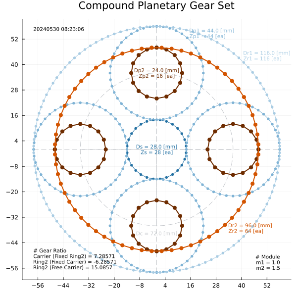
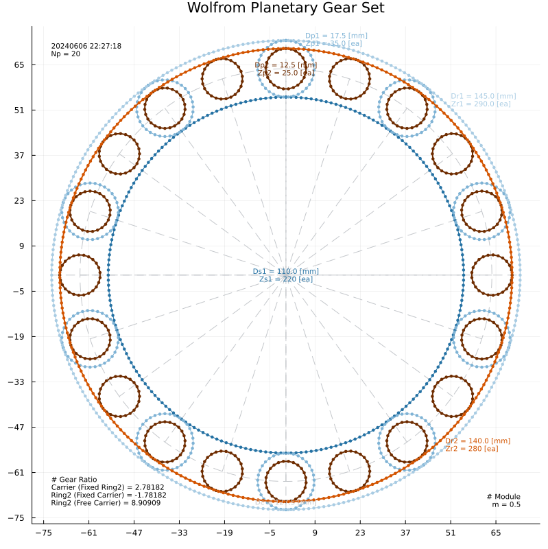

# PGS

_Sizing Tool for Planetary Gear Set - with Julia Lang in Jupyter Notebook_

## Codes

* `PGS.ipynb` : Tool for Simple / Compound Planetary
* `WOLFROM.ipynb` : Tool for Wolfrom Planetary

## Feature

## Thank you!