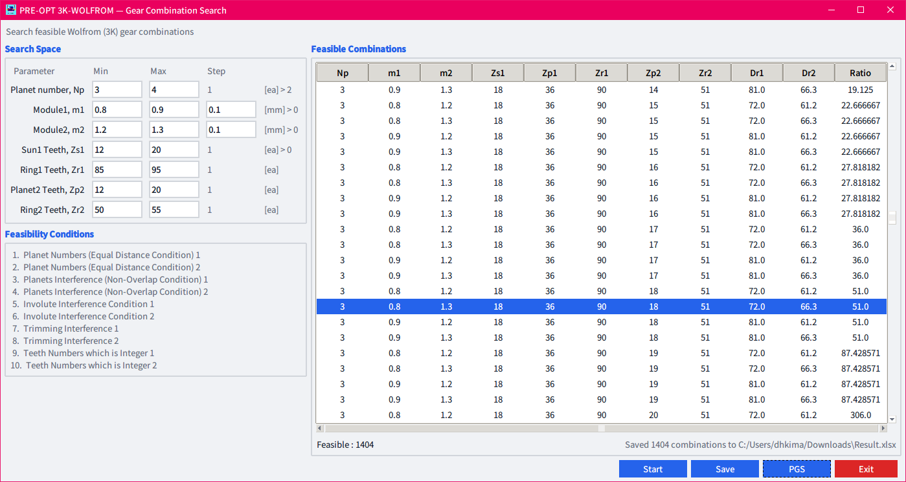

# PGS

_Sizing Tool for Planetary Gear Set (Simple & Wolfrom)_

Computes gear ratios, gear sizes, and geometric feasibility checks for
simple and Wolfrom-type planetary gear sets. The tool is built with Python
and provides a ttk-based graphical interface.

* [MANUAL.md](MANUAL.md)

## Gear Types

| Type | Code | Description |
|------|------|-------------|
| Simple | 0 | Standard single-stage planetary set |
| 3K-Wolfrom | 1 | Wolfrom set; both ring tooth counts (`Ring1 Teeth, Zr1` and `Ring2 Teeth, Zr2`) are independent inputs entered directly in the UI, and the ratios and stage-2 mesh shift are derived from them |

## Gear Set Architecture

The model contains six gears arranged in two stages:

| Gear | Description |
|------|-------------|
| Gs1 | Sun gear, stage 1 |
| Gp1 | Planet gear, stage 1 |
| Gr1 | Ring gear, stage 1 |
| Gs2 | Sun gear, stage 2 |
| Gp2 | Planet gear, stage 2 |
| Gr2 | Ring gear, stage 2 |

## Geometric Checks

The following feasibility checks are performed on the stage-1 (shared carrier) gear set:

- Non-factorizing (sequential mesh condition)
- Equal distance condition (planet spacing)
- Planets interference (non-overlap condition)
- Involute interference
- Trimming interference
- Integer tooth numbers

## Prerequisites

- [uv](https://docs.astral.sh/uv/) package manager

## Installation

```bash
git clone https://codeberg.org/dymaxionkim/PGS.git
cd PGS
uv sync
```

## Usage

Run the GUI:

```bash
uv run design.py
```

Passing a Markdown report path loads its `## Input Parameters` section at startup — the same refill the **Load** button performs — and runs the loaded design immediately:

```bash
uv run design.py Result/README.md
```

Or use the platform launcher:

- `PGS.bat` on MS Windows
- `./PGS.sh` on Linux

### Pre-Optimization (PRE-OPT_3K-WOLFROM)

Before designing a single combination with `design.py`, the pre-optimization tool scans a 3K-Wolfrom parameter space and lists every geometrically feasible tooth/module combination in a table:

```bash
uv run PRE-OPT_3K-WOLFROM.py   # or PRE-OPT_3K-WOLFROM.bat / .sh
```



- **Search Space** — the independent inputs (min/max/step) in the order `Np`, `m1`, `m2`, `Zs1`, `Zr1`, `Zp2`, `Zr2`. Integer parameters step by 1; only the modules have a Step column. Defaults: m1 0.8–0.9 (step 0.1), m2 1.2–1.3 (step 0.1), Np 3–4, Zr2 50–55, Zp2 35–40, Zr1 85–95, Zs1 15–20.
- **Start** — runs the search and fills the table only: no folder picker and no file is written. It evaluates 10 checks (the stage-1 checks on `(Zs1, Zp1, Zr1, Np)` plus their stage-2 analogue on `(Zr2, Zp2, Np)`, skipping the virtual Gs2), using two pre-pass tables for speed.
- **Save** (immediately right of Start) — asks for a folder and writes the current table to `Result.xlsx`. Warns when there is nothing to save yet, and refuses to save more rows than the Excel row limit (1 048 576).
- **PGS** (right of Save) — enabled only when exactly one table row is selected; launches `design.py` with that row's parameters pre-filled (it writes a temporary report and starts `python design.py <report>`).
- **Table columns** — `Np, m1, m2, Zs1, Zp1, Zr1, Zp2, Zr2, Dr1, Dr2, Ratio`, where `Dr1 = m1·|Zr1|`, `Dr2 = m2·|Zr2|` and `Ratio` is the Type-3K total ratio `g22`. `Zp1 = (|Zr1| − Zs1)/2` follows from the equal-distance condition.

### Input Parameters


| Parameter | Description |
|-----------|-------------|
| Type | Gearbox type from the table above |
| Planet number, Np | Number of planets [ea], > 2 |
| Module1, m1 | Stage-1 gear module [mm], > 0 |
| Module2, m2 | Stage-2 gear module [mm], > 0 |
| Sun1 Teeth, Zs1 | Sun gear stage 1 teeth number [ea], > 0; defines gear ratio |
| Ring1 Teeth, Zr1 | Stage-1 ring gear teeth number [ea], > 0; independent input for both Simple and 3K-Wolfrom |
| Planet2 Teeth, Zp2 | Stage-2 planet gear teeth number [ea], > 0 (3K-Wolfrom only); stage-2 planets are placed on the stage-1 carrier radius |
| Ring2 Teeth, Zr2 | Stage-2 ring gear teeth number [ea], > 0 (3K-Wolfrom only); entered right below Zp2. Together with Zr1, Zp2, Zs1, m1, m2 it determines the gear ratios and the stage-2 mesh (adjust the two rings to tune the reduction ratio). The stage-2 sun `Zs2 = (dc − dp2)/m2` is derived from the shared carrier radius and may be fractional |
| Input speed, ns1 | Input speed of the stage-1 sun gear Gs1 [rpm]; used to compute the operating speeds shown in the Speed block |
| Shift factor, Gs1.X | Profile shift coefficient of stage-1 sun gear |
| Shift factor, Gp1.X | Profile shift coefficient of stage-1 planet gear; together with Gs1.X it determines the carrier radius |
| Shift factor, Gp2.X | Profile shift coefficient of stage-2 planet gear |
| Backlash factor, B | Backlash adjustment |
| Addendum factor, A | Addendum coefficient |
| Dedendum factor, D | Dedendum coefficient |
| Pressure angle, α | Pressure angle [deg] (default 20°) |
| Hob end radius, C | Radius of hob tip [mm] |
| Tooth end radius, E | Radius of tooth tip [mm] |
| Plot option | Scope of the interactive preview: `Stage1` / `Stage2` / `Total`, or a single gear: `Gs1`, `Gp1`, `Gr1` (stage 1), `Gp2`, `Gr2` (stage 2) — only the selected layout is drawn. Simple offers the stage-1 options only. The saved images always cover every applicable scope (see "Result files") |
| Teeth profile | `Involute Teeth` (GPG) / `Cycloid Teeth` (CPG), or **`All`** to overlay both profiles in one plot (involute grey/black, cycloid blue) |

### Run vs Load vs Save

- **Run** computes the gearbox, fills the result panel and shows the plot preview of the selected Plot option (no files are written).
- **Load** asks for a `README.md` file (e.g. a previously saved `Result/README.md`), reads its `## Input Parameters` section, refills the input widgets (ring tooth counts are stored negative in the report and converted back to the positive numbers the fields expect), and runs the calculation like **Run**. It is the way to reopen and continue a saved design. The same refill happens automatically at startup when a report path is passed on the command line (`uv run design.py Result/README.md`).
- **Save** re-runs the calculation, asks which folder to use (directory picker), then creates a `Result` directory inside it and writes every output file — including the `Result/README.md` that **Load** reads back.

### Command line (headless)

`PGS_CLI.py` re-runs a saved design without the GUI — it reads the `## Input Parameters` section of a Markdown report, performs the exact same calculation as **Run**, and exports every result file next to the input file:

```
uv run PGS_CLI.py <README.md> [SaveAll|SaveOK|SaveMD]
```

- `<README.md>` — path to a Markdown file carrying the `## Input Parameters` section (e.g. `Result/README.md`).
- `SaveAll` (default when omitted) — writes the report `README.md`, the `Involute_*`/`Cycloid_*`/`All_*.png` drawings, and the per-gear folders (`Gs1`/`Gp1`/`Gr1`[`/Gp2`/`Gr2`] with `Involute`/`Cycloid` inside), all **in the same folder as the input file**, with the same layout as GUI **Save**.
- `SaveOK` — skips writing anything when the regenerated `## Check Geometrical Conditions` contains a `Fail` status.
- `SaveMD` — like `SaveOK`, writes nothing while any check is `Fail`; when every check is `OK` it writes **only the report `README.md`** (no drawings, no per-gear folders).

Note: since the report is written as `README.md` in the input file's folder, an input file that is itself named `README.md` will be overwritten by the regenerated report.

### Result files

The `Result/` folder created by **Save** contains:

```
Result/
├─ README.md                  ← the same report text shown in the result panel
├─ Involute_*.png / Cycloid_*.png / All_*.png   ← profile drawings (see below)
└─ Gs1/ Gp1/ Gr1/ [Gp2/ Gr2/] ← one folder per exported gear (Gs2 is never exported)
   ├─ Inputs.csv
   ├─ Involute/               ← Inputs.csv + Result.csv + Result.dxf + Result1.png + Result2.png
   └─ Cycloid/                ← the same five files with the cycloid profile
```

Drawing file names by gearbox type:

- **3K-Wolfrom**: `Involute_*` / `Cycloid_*` for `Total`, `Stage1`, `Stage2`, `Gs1`, `Gp1`, `Gr1`, `Gp2`, `Gr2`; combined-overlay `All_*` for `Total` and each gear.
- **Simple**: `Involute_*` / `Cycloid_*` for `Stage1`, `Gs1`, `Gp1`, `Gr1`; combined-overlay `All_*` for `Stage1` and each gear.

The per-gear `Involute/` and `Cycloid/` subfolders are generated by the bundled FGPG2 gear generator (`fgpg2/` package + `FGPG2_CLI.py`) for the matching profile; the combined `All_*` images overlay both profiles.

The ring gear shift factors (Gr1.X, Gr2.X) are not inputs: they are computed automatically so that the ring teeth mesh with the planet teeth without flank clearance (zero backlash) at the carrier radius, taking the input shift factors (Gs1.X, Gp1.X, Gp2.X) into account. With backlash B = 0 there is no tooth gap for any shift combination; the B input adds flank clearance on top of this, as intended.

Ring gear tooth counts are entered directly and kept as whole numbers (rounded if needed). The stage-1 planet count follows from the equal-distance condition (`Zp1 = (|Zr1| − Zs1)/2`), and the stage-2 mesh mismatch against the shared carrier radius is absorbed by the automatically computed ring profile shifts (Gr1.X, Gr2.X).

### Cycloidal teeth

Choosing **Cycloid Teeth** generates tooth profiles with epicycloidal/hypocycloidal flanks (`CPG.py`, the same interface as `GPG`). The tooth circular thickness is `πm/2 − mB` regardless of the profile shift, so shifted mates mesh without interference. Choosing **All** overlays the involute and cycloid profiles in a single plot for direct comparison.

> Limitation: a cycloidal tooth profile requires a whole tooth count. In Wolfrom layouts the stage-2 sun `Zs2` can be fractional (e.g. 15.0667). When **Save** runs, the affected `Cycloid_*` / `All_*` images are skipped with a `WARN` on the console (all involute images, the report and the per-gear FGPG2 results are still written). When previewing with **Run**, `Cycloid Teeth` / `All` raises at profile generation — use `Involute Teeth`, or adjust `Zs1`, `Np`, `Zr1`, `Zr2`, `Zp2` so `Zs2` becomes an integer.


### Output

The result panel displays:

- **Ratio** — gear ratios for each stage and total (carrier fixed / ring fixed / 3K type)
- **Speed** — operating speeds of the input sun (Gs1), carrier, both rings (Gr1, Gr2) and compound planets (Gp1,Gp2) in [rpm], reported for the three lockup configurations of a Wolfrom (Type-3K with ring1 fixed / ring2 fixed with carrier output / carrier fixed with ring2 output) or the two of a Simple (carrier fixed with ring1 output / ring1 fixed with carrier output); each value carries an explicit +/- direction sign relative to the input rotation of Gs1
- **Size** — pitch circle diameters and tooth counts for all six gears (three stage-1 gears for Simple)
- **Checks** — pass/fail status for each geometric feasibility check

## Files

| File | Purpose |
|------|---------|
| `design.py` | GUI entry point (ttk theme, layout, event handlers, matplotlib plotting, report/CSV output) |
| `PGS.py` | Planetary gear sizing logic |
| `GPG.py` | Generic involute gear profile generation (external/internal gears) |
| `CPG.py` | Cycloidal gear profile generator, drop-in replacement sharing the `GPG` interface |
| `FGPG2_CLI.py` | Bundled FGPG2 CLI entry (`FGPG2_CLI.py <Inputs.csv> [involute\|cycloid]`) that regenerates the per-gear Result files |
| `PGS_CLI.py` | Headless CLI runner (`PGS_CLI.py <README.md> [SaveAll\|SaveOK\|SaveMD]`) — runs the same calculation as **Run** from a report's `## Input Parameters` and exports all files next to it |
| `fgpg2/` | Ported FGPG2 generator package (`gear.py`, `cycloid.py`, `exporters.py`, `plotter.py`) used in-process to write `Result.csv` / `Result.dxf` / `Result1.png` / `Result2.png` |
| `PGS.bat` / `PGS.sh` | Platform launcher scripts |
| `PRE-OPT_3K-WOLFROM.py` | Pre-optimization search GUI — scans a 3K-Wolfrom parameter space, lists the feasible tooth/module combinations in a table, exports them to `Result.xlsx`, and opens the selected combination in `design.py` |
| `PRE-OPT_3K-WOLFROM.bat` / `PRE-OPT_3K-WOLFROM.sh` | Pre-optimization launcher scripts |

## Thank you!