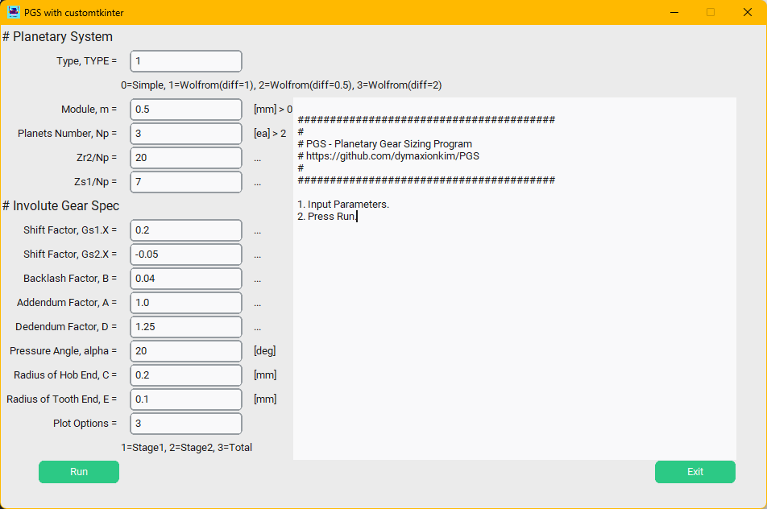

# PGS

_Sizing Tool for Planetary Gear Set_

## Prerequisites

```
pip install numpy matplotlib customtkinter
```

## Exe script
* `PGS.bat` for MS Windows : Check and modofy python environment for you
* `python design.py` for Linux and etc.

## How to use



* _Type_ : Choose Gearbox Type
* _Module_ : Gear Module
* _Np_ : Planet Number
* _Zr2/Np_ : (Teeth Number of Ring Gear Stage 2nd)/(Planet Number) to define outer dia of gearbox
* _Zs1/Np_ : (Teeth Number of Sun Gear Stage 1st)/(Planet Number) to define gear ratio
* _Gs1.X_ : Shift factor of Sun Gear Stage 1st
* _Gs2.X_ : Shift factor of Sun Gear Stage 2nd
* _B_ : Backlash factor
* _A_ : Addendum factor
* _D_ : Dedendum fator
* _alpha_ : Pressure Angle
* _C_ : Radius of Hob end
* _E_ : Radius of Tooth end
* _Plot Options_ : Option for Ploting

* Press `Run` button to plot.


* Check detail spec in textbox.


## Thank you!